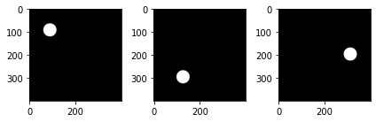
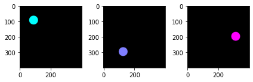
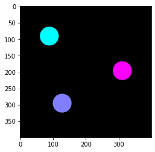

# Image stacks in Python (multi-page tiff)

[](https://zenodo.org/badge/latestdoi/166888905)

`multipagetiff` is a python module that makes easier working with multipage images (stacks). Image stacks are often found as multi-page tiff files.

With this module one can read, manipulate and display multi-page tiff files and apply depth color-coding by max-projection, like the Z-projection functions of ImageJ.

# Install
instal with `pip`
```sh
pip install multipagetiff
```

## Usage example
```python
from matplotlib import pyplot as plt
import multipagetiff as tiff
```

## load a stack
Load a stack and display its frames.
The stack here is the 3D image of an actin filament imaged with a super-resolution specle microscope ([M.Pascucci et al. 2019 Nat. Com.](https://www.nature.com/articles/s41467-019-09297-5.pdf?origin=ppub)).


```python
plt.figure(figsize=(7,7))
# Load the stack and define the resolution and the units
s = tiff.Stack("actin_filament.tif", dx=10, dz=50, units='nm')
# The frames to display can be specified with the frames parameter
# e.g. frames=range(5,15)
tiff.plot_frames(s, cmap='gray')
```


    

    


## z max-projection


```python
# set the colormap
tiff.set_cmap(plt.cm.cool)
# plot the stack
tiff.plot_flatten(s)
```


    

    


## Refine the image


```python
# set XY crop area
s.crop = [50,50,270,270]

# set Z range
s.set_start_in_units(-550)
s.set_end_in_units(700)

# plot with threshold
tiff.plot_flatten(s, threshold=0.25)
```


    

    


---

## Detailed example


```python
st = tiff.Stack('Stack.tiff', dx=1, dz=1, z_label='depth', units='mm')

print("the stack has {} pages".format(len(st))) # number of frames
```

    the stack has 3 pages


## plot a stack

Plot page by page. The Stack object behaves like a list, which elements are the frames


```python
plt.subplot(1,3,1)
plt.imshow(st[0], cmap='gray')
plt.subplot(1,3,2)
plt.imshow(st[1], cmap='gray')
plt.subplot(1,3,3)
plt.imshow(st[2], cmap='gray')
plt.tight_layout()
```


    

    


Display the frame of the stack with the plot_frames function


```python
tiff.plot_frames(st, cmap='gray')
```


    

    


## color code


```python
cc = tiff.color_code(st)

plt.subplot(1,3,1)
plt.imshow(cc[0])
plt.subplot(1,3,2)
plt.imshow(cc[1])
plt.subplot(1,3,3)
plt.imshow(cc[2])
plt.tight_layout()
```


    

    


```python
# If you need to print only a part of the stack, select it with
# st.set_start_in_units(start) and st.set_end_in_units(end)

tiff.plot_frames(st, colorcoded=True)
```


    

    


## max projection

Create a color coded RGB image representing frame-depth. The image is the max projection of the color coded stack.


```python
mp = tiff.flatten(st)
plt.imshow(mp)
```


    <matplotlib.image.AxesImage at 0x7fb8d639a3a0>


    

    


plot the max projection, together with its colorbar


```python
tiff.plot_flatten(st)
```


    

    


## change colormap

Use a matplotlib preset colormap


```python
tiff.set_cmap(plt.cm.cool)
tiff.plot_flatten(st)
```


    

    


or define you own colormap


```python
from matplotlib.colors import LinearSegmentedColormap

my_colors = [(1,0,0),(0,1,0),(0.0,0.5,1)]
my_cmap = LinearSegmentedColormap.from_list("myCmap", my_colors, N=256)
tiff.set_cmap(my_cmap)
tiff.plot_flatten(st)
```


    

    
