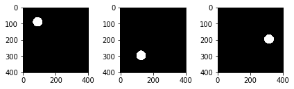
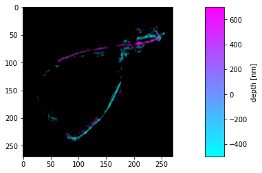
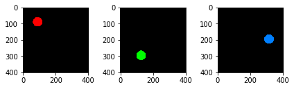
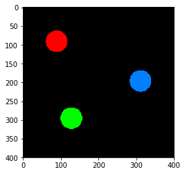
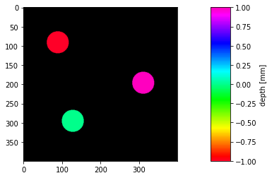
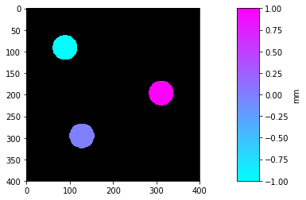
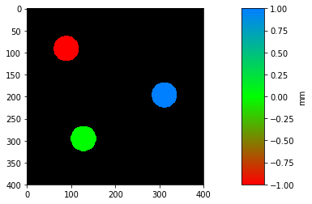

# Multi-page TIFF utility for Python

`multipagetiff` is a python module that makes dealing with multipage tiff stacks of images easier.
It implements depth color-coding by max-projection, like the Z-projection functions of ImageJ.

# Install
instal with `pip`
```sh
pip install multipagetiff
```

## Usage example

```python
import multipagetiff as tiff
from matplotlib import pyplot as plt
```

## Open a multipage TIFF image


```python
st = tiff.Stack('Stack.tiff', dx=1, dz=1, z_label="depth", z_units='mm')
print("the stack has {} pages".format(len(st))) # number of frames
```

    the stack has 3 pages


## plot a stack

Plot page by page. The Stack object behaves like a list, wihch elements are the frames.


```python
plt.subplot(1,3,1)
plt.imshow(st[0], cmap='gray')
plt.subplot(1,3,2)
plt.imshow(st[1], cmap='gray')
plt.subplot(1,3,3)
plt.imshow(st[2], cmap='gray')
plt.tight_layout()
```





Display the frame of the stack with the plot_frames function


```python
tiff.plot_frames(st, cmap='gray')
```





## color code


```python
cc = tiff.color_code(st)

plt.subplot(1,3,1)
plt.imshow(cc[0])
plt.subplot(1,3,2)
plt.imshow(cc[1])
plt.subplot(1,3,3)
plt.imshow(cc[2])
plt.tight_layout()
```





```python
tiff.plot_frames(st, colorcoded=True)
```


## max projection

Create a color coded RGB image representing frame-depth. The image is the max projection of the color coded stack.


```python
mp = tiff.flatten(st)
plt.imshow(mp)
```




plot the max projection, together with its colorbar


```python
tiff.plot_flatten(st)
```





## change colormap

Use a matplotlib preset colormap


```python
tiff.set_cmap(plt.cm.cool)
tiff.plot_flatten(st)
```





or define you own colormap


```python
from matplotlib.colors import LinearSegmentedColormap

my_colors = [(1,0,0),(0,1,0),(0.0,0.5,1)]
my_cmap = LinearSegmentedColormap.from_list("myCmap", my_colors, N=256)
tiff.set_cmap(my_cmap)
tiff.plot_flatten(st)
```



