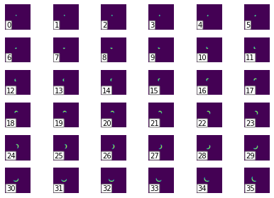
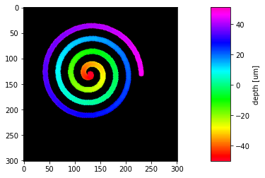
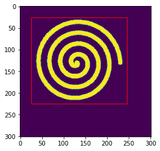
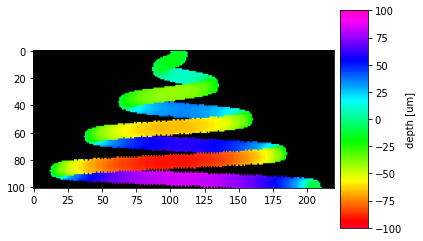

# Image stacks in Python (multi-page tiff)

cite this software:
[](https://zenodo.org/badge/latestdoi/166888905)

`multipagetiff` is a python module that simplifies working with multipage images (stacks). Image stacks are often found as multi-page tiff files.

With this module one can read/write, manipulate and display multi-page tiff files and apply depth color-coding by max-projection, like the Z-projection functions of ImageJ.

# Install
instal with `pip`
```sh
pip install multipagetiff
```

## Usage example

Have a look at the [cookbook](examples/markdown/example.md), it contains examples and explications for a quick start.

The following is a very short example of a depth colored z max-projection of an image stack:

```python
import multipagetiff as mtif
from matplotlib import pyplot as plt
```


```python
# load the stack
s = mtif.read_stack("spiral.tif", units='um')
s
```


    Multi-Page Stack of 101 pages. (dx=dy=1um, dz=1um, crop=[0, 301, 0, 301]], page limits=[0, 101])


```python
# plot the pages separately
mtif.plot_pages(s)
```


    

    


```python
# plot the z-max-projection
mtif.plot_flatten(s)
```

    (101, 301, 301, 3)


    

    


```python
# set a crop
s.crop_horizontal = 25,245
s.crop_vertical = 25,225
mtif.plot_selection(s)
```


    

    


```python
mtif.plot_flatten(s)
```

    (101, 200, 220, 3)


    

    


```python
mtif.plot_flatten(s, axis=1)
```


    

    


# Orthogonal views
---


```python
# Plot orthogonal views of the stack.
# i.e. 3 orthogona; slices intersecting at a specified point (stack's center by default)
mtif.plot.orthogonal_views(s, cmap="gray")
```


    

    