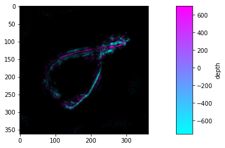

# Image stacks in Python (multi-page tiff)

cite this software:
[](https://zenodo.org/badge/latestdoi/166888905)

`multipagetiff` is a python module that simplifies working with multipage images (stacks). Image stacks are often found as multi-page tiff files.

With this module one can read/write, manipulate and display multi-page tiff files and apply depth color-coding by max-projection, like the Z-projection functions of ImageJ.

# Install
instal with `pip`
```sh
pip install multipagetiff
```

## Usage example

# z max-projection

Have a look at the [cookbook](examples/markdown/example.md), it contains examples and explications for a quick start.

The following is a very short example of a depth colored z max-projection of an image stack:

```python
import multipagetiff as mtif
# set the colormap
s = mtif.read_stack("actin_filament.tif", dx=10, dz=50, units='nm')
mtif.set_cmap(plt.cm.cool)
# plot the stack
mtif.plot_flatten(s)
```
    


