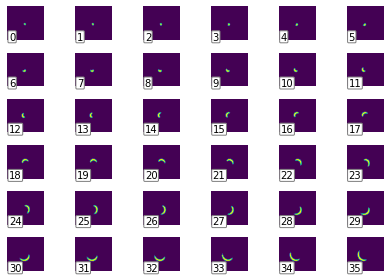
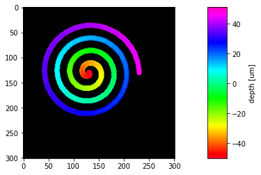
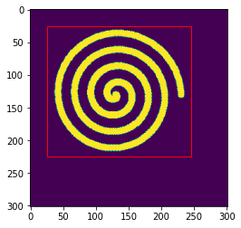
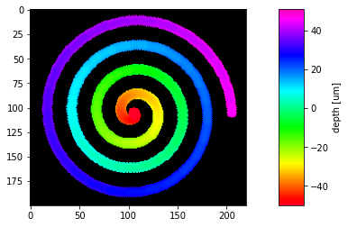

```python
import multipagetiff as mtif
from matplotlib import pyplot as plt
```


```python
# load the stack
s = mtif.read_stack("spiral.tif", units='um')
s
```


    Multi-Page Stack of 101 pages. (dx=dy=1um, dz=1um, crop=[0, 301, 0, 301]], page limits=[0, 101])


```python
# plot the pages separately
mtif.plot_pages(s)
```


    

    


```python
# plot the z-max-projection
mtif.plot_flatten(s)
```


    

    


```python
# set a crop
s.crop_horizontal = 25,245
s.crop_vertical = 25,225
mtif.plot_selection(s)
```


    

    


```python
mtif.plot_flatten(s)
```


    

    

